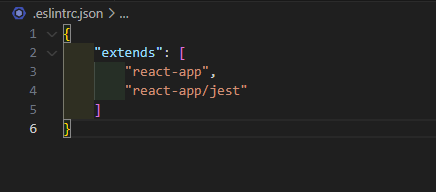

# react-yarn-v4-standard
#### `폴더에 있는 이미지 파일 삭제`

## ✔ 세팅 버전 ( Version )

#### ✔ **Node** : 20.12.1

#### ✔ **Yarn berry** : 3.8.0

#### ✔ **React** : 18.2.0

## 📖 특징 ( Features )


## 1️⃣ 초기설치 ( Setup )

### 0. Node Version 확인

```bash
node -v  // 20.12.1
```

#### ❌ Node 버전 틀린 경우

```bash
// 터미널 열기 (관리자권한)

(1)
nvm list
nvm use 20.12.1

(2)
# node v 20.12.1 없을경우 ❌
# nvm 버전 설치
# 리스트에 다운로드 여부 확인 ✔

nvm install 20.12.1
nvm list
nvm use 20.12.1
```

### 1. Yarn 설치

```bash
npm install -g yarn
```

### 2. create react-app ( typescript )

```bash
# React + TypeScript 프로젝트
yarn create react-app my-app --template typescript

# TypeScript + NextJS 프로젝트
yarn create next-app --typescript
```

### 3. Yarn berry 활성화

```bash
# 최신버전으로 다운로드
yarn set version berry

# 특정 버전 다운
yarn set version [version]
```

### 4. pnp 설정

- node_modules로 디펜던시 모듈들이 설치되지 않는다.
- zip으로 된 각 모듈의 의존성 트리 정보들은 프로젝트 루트의 .pnp.cjs 파일로 관리

  #### 4-1 PnP 설정

  1. .yarnrc.yml 폴더에서 nodeLinker 수정
     
  2. $ yarn install
  3. Yarn berry 와 IDE 통합 - **ZipFs Plugin 익스텐션설치**

```bash
yarn dlx @yarnpkg/sdks vscode

- allow 를 누르고 사용한다
# 누르지 못할경우 타입스크립트 파일에서
# ctrl + shift + p > Select TypeScript Version 클릭 > use Workspace version 클릭
```

### 5. .gitignore 설정 ( zero-install )

```bash
#.gitignore 에 추가

# yarn zero install
.yarn/*
!.yarn/cache
!.yarn/patches
!.yarn/plugins
!.yarn/releases
!.yarn/sdks
!.yarn/versions
```

### ❌ App.test.tsx 에서 에러

#### Error


#### 해결

```bash
# remove
yarn remove @testing-library/jest-dom

# install
yarn add -D @types/testing-library__jest-dom @testing-library/jest-dom
```

## 2️⃣ ESLint / Prettier 적용
### ESLint 설정 

#### 1. ESLint dependencies 추가 
```bash
yarn add -D eslint prettier eslint-plugin-prettier eslint-config-prettier eslint-plugin-react eslint-config-react-app
```

#### 2. Config 분리 

1. 폴더안에 .eslintrc.json 생성
2. CRA로 만들어진 eslinConfig 안에 extends 복사해서 .eslint.json 붙여넣기


3. package.json 에서 eslintConfig 지우기


