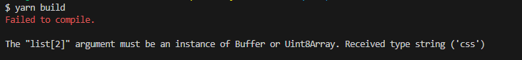
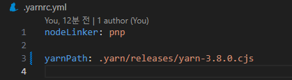
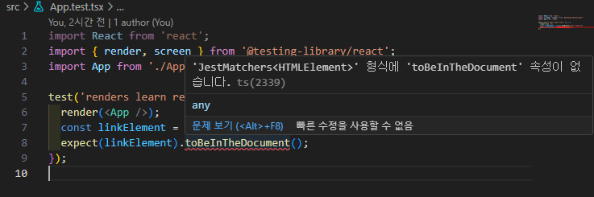
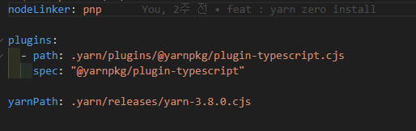
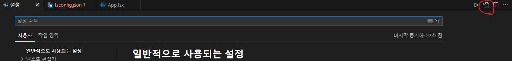
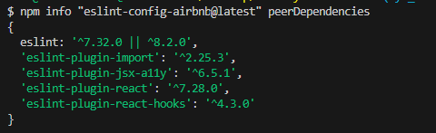
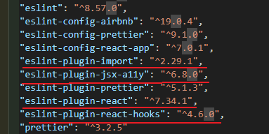

# react-yarn-standard

#### 🛒 폴더에 있는 이미지 파일 삭제

## ✔ 세팅 버전 ( Version )

#### ✔ **Node** : 20.11.0

- 20.12.1 LTS(24.04.08기준)는 build가 계속 에러나는 현상이 발생
- 첫 빌드는 무사히 완료 이후 두번째부터 static 이라는 파일만 생긴다.

(참고 사진)



#### ✔ **Yarn berry** : 3.8.0

#### ✔ **React** : 18.2.0

## 📖 특징 ( Features )

- ⚛️ Create React APP
- 0️⃣ Zero-install
- 💢 ESLint & Prettier
- 🎨 Emotion

## 💡 규칙 ( Rulse )

### _ESLint_

<hr />

### _Prettier_

**useTabs**

- 탭(tab) 사용 여부를 결정하는 불리언 값입니다.
- `use` : false로 설정되어 있으므로 스페이스를 사용하고 있습니다.

**printWidth**

- 코드 줄의 최대 길이입니다.
- 초과하면 줄 바꿈이 이루어집니다.
- `use` : 80으로 설정되어 있으므로 한 줄의 코드가 80자를 초과하면 줄 바꿈

**tabWidth**

- 탭(tab) 또는 스페이스로 들여쓰기 할 때 사용할 공백 수입니다.
- `use` : 2로 설정되어 있으므로 2칸 들여쓰기를 사용합니다.

**singleQuote**

- 문자열을 홑따옴표(')로 사용할지 여부를 결정하는 불리언 값입니다.
- `use` : true로 설정되어 있으므로 홑따옴표를 사용합니다.

**trailingComma**

- 객체나 배열의 마지막 요소 뒤에 쉼표를 추가할지 여부를 결정합니다.
- `use` : "all"로 설정되어 있으므로 모든 경우에 쉼표를 추가합니다.

**endOfLine**

- 개행 문자 종류를 결정합니다.
- `use` : "lf"로 설정되어 있으므로 Unix 스타일의 줄 바꿈 문자(LF)를 사용합니다.

**semi**

- 세미콜론(;) 사용 여부를 결정하는 불리언 값입니다.
- `use` : false로 설정되어 있으므로 세미콜론을 사용하지 않습니다.

**arrowParens**

- 화살표 함수의 매개변수가 하나인 경우에 괄호를 사용할지 여부를 결정합니다.
- `use` : "always"로 설정되어 있으므로 항상 괄호를 사용합니다.

<hr />

## 1️⃣ 초기설치 ( Setup )

### 0. Node Version 확인

```bash
node -v  // 20.12.1
```

### ❌ Node 버전 틀린 경우

```bash
// 터미널 열기 (관리자권한)

(1)
nvm list
nvm use 20.12.1

(2)
# node v 20.12.1 없을경우 ❌
# nvm 버전 설치
# 리스트에 다운로드 여부 확인 ✔

nvm install 20.12.1
nvm list
nvm use 20.12.1
```

### 1. Yarn 설치

```bash
npm install -g yarn
```

### 2. create react-app ( typescript )

```bash
# React + TypeScript 프로젝트
yarn create react-app my-app --template typescript

# TypeScript + NextJS 프로젝트
yarn create next-app --typescript
```

### 3. Yarn berry 활성화

```bash
# 최신버전으로 다운로드
yarn set version berry

# 특정 버전 다운
yarn set version [version]
```

### 4. pnp 설정

- node_modules로 디펜던시 모듈들이 설치되지 않는다.
- zip으로 된 각 모듈의 의존성 트리 정보들은 프로젝트 루트의 .pnp.cjs 파일로 관리

  #### 4-1 PnP 설정

  1. .yarnrc.yml 폴더에서 nodeLinker 수정
     
  2. $ yarn install
  3. Yarn berry 와 IDE 통합 - **ZipFs Plugin 익스텐션설치**

```bash
yarn dlx @yarnpkg/sdks vscode

- allow 를 누르고 사용한다
# 누르지 못할경우 타입스크립트 파일에서
# ctrl + shift + p > Select TypeScript Version 클릭 > use Workspace version 클릭
```

### 5. .gitignore 설정 ( zero-install )

```bash
#.gitignore 에 추가

# yarn zero install
.yarn/*
!.yarn/cache
!.yarn/patches
!.yarn/plugins
!.yarn/releases
!.yarn/sdks
!.yarn/versions
```

### ❌ App.test.tsx 에서 에러

### Error



### 해결

```bash
# remove
yarn remove @testing-library/jest-dom

# install
yarn add -D @types/testing-library__jest-dom
yarn add -D @testing-library/jest-dom
```

### 설치가 완료되면 tsconfig.json 파일에 들어가서

```json
//"compilerOptions" 안에 type 추가 해준다.
"types": ["jest", "@testing-library/jest-dom"]
```

### 6. #타입 정의가 없는 패키지 설치위한 plugin 설치

```bash
# 타입 정의가 없는 패키지 설치 시 가능하면 @types/* 패키지를 함께 설치합니다.
# 버전 확인하고 사용하기 (확인 안할시 설치만되고 적용안됨)
# 플러그인은 따로 버전정해서 설치못하는걸로 알고있음.!!
yarn plugin import typescript
```



## 2️⃣ ESLint / Prettier 적용

### vscode Extends 설치

- Prettier - Code formatter 설치
- ESLint 설치

## 🛠 ESLint 설정

### 1. ESLint 및 Prettier dependencies 추가

```bash
yarn add -D eslint prettier eslint-plugin-prettier eslint-config-prettier eslint-plugin-react eslint-config-react-app
```

### ❌ Error 발생

> Cannot find module 'prettier' from
>
> > node-modules 폴더가 없어서 에러가 발생된다.

```bash
# 재실행
yarn dlx @yarnpkg/sdks vscode
```

### 2. Config 분리

1. 폴더안에 .eslintrc.json 생성
2. CRA로 만들어진 eslinConfig 안에 extends 복사해서 .eslint.json 붙여넣기

```json
// .eslintrc.json
{
  "extends": ["react-app", "react-app/jest"]
}
```

3. package.json 에서 eslintConfig 지우기

### 3. ESLint rulse, extends 수정

```json
{
  // [extends] 프로젝트에 적용할 eslit 규칙셋
  "extends": ["react-app", "react-app/jest", "plugin:prettier/recommended"],
  // [plugins] 사용할 eslint 플러그인 설정
  "plugins": ["prettier"],
  "rules": {
    // prettier 와 eslint 규칙 겹치는 부분 방지
    "prettier/prettier": "error"
  }
}
```

## 🛠 Prettier 설정

### 1. prettier 파일 추가

- .prettierrc 파일생성

### 2. prettier 규칙 생성

```json
{
  "useTabs": false,
  "printWidth": 80,
  "tabWidth": 2,
  "singleQuote": true,
  "trailingComma": "all",
  "endOfLine": "lf",
  "semi": false,
  "arrowParens": "always"
}
```

### 3. OS 별 호환성 맞추기

`command`

- window : ctrl + ,
- mac : ctrl + ,

1. json 열기를 눌러준다.



2. settings.json 수정

```json
{
  // 파일을 저장할 때 eslint 수정
  "editor.codeActionsOnSave": {
    "source.fixAll.eslint": true
  },
  // 모든 파일을 저장할 때 LF 형식으로 저장 (Window 사용자만 설정)
  "files.eol": "\n"
}
```

3. yarn dlx pkg 재설치

```bash
yarn dlx @yarnpkg/sdks vscode
```

### ❌ Error 발생

> Error: Required unplugged package missing from disk. This may happen when switching branches without running installs
>
> > node-mudules 가 없어서 Error

```bash
# yarn install
yarn
# 재설치
yarn dlx @yarnpkg/sdks vscode
```

4. lint 검사 및 수정 scripts 생성

```json
"scripts": {
    "start": "react-scripts start",
    "build": "react-scripts build",
    "test": "react-scripts test",
    "eject": "react-scripts eject",
    // 파일 전체 lint 검사
    "lint": "eslint \"src/**/*.{js,jsx,ts,tsx}\"",
    // 파일 전체 lint 수정
    "lint:fix": "eslint --fix \"src/**/*.{js,jsx,ts,tsx}\""
},
```

<hr/>

## 3️⃣ Craco 세팅

### 🙄 Craco 란?

- Craco는 Create-React-App Configuration Override의 약어
- CRA에 config 설정을 덮어쓰기 위한 패키지
- <a href="https://craco.js.org/">Craco 사이트</a>
<hr/>

### 1. Craco 설치

```bash
yarn add -D @craco/craco
yarn add -D craco-alias
```

### 2. 경로 규칙 설정할 json 파일 생성 및 규칙

1. tsconfig.paths.json 파일 생성
2. json에 규칙 생성

```json
{
  "compilerOptions": {
    "baseUrl": ".",
    "paths": {
      "@/*": ["src/*"],
      "@components/*": ["src/components/*"]
    }
  }
}
```

### 3. craco.config.js 파일 생성 및 module 생성

```javascript
const CracoAlias = require('craco-alias')

module.exports = {
  plugins: [
    {
      plugin: CracoAlias,
      options: {
        source: 'tsconfig',
        tsConfigPath: 'tsconfig.paths.json',
      },
    },
  ],
}
```

### 4. tsconfig.json extends 추가와 include 수정

```json
{
  // paths 경로 설정했던것 확장
  "extends": "./tsconfig.paths.json",
  "compilerOptions": {
    "target": "es5",
    "lib": ["dom", "dom.iterable", "esnext"],
    "allowJs": true,
    "skipLibCheck": true,
    "esModuleInterop": true,
    "allowSyntheticDefaultImports": true,
    "strict": true,
    "forceConsistentCasingInFileNames": true,
    "noFallthroughCasesInSwitch": true,
    "module": "esnext",
    "moduleResolution": "node",
    "resolveJsonModule": true,
    "isolatedModules": true,
    "noEmit": true,
    "jsx": "react-jsx"
  },
  // tsconfig.paths.json 포함한다.
  "include": ["src", "tsconfig.paths.json"]
}
```

### 5. package.json scripts 변경

- craco로 수정해준다.

```json
"scripts": {
    "start": "craco start",
    "build": "craco build",
    "test": "craco test",
    "eject": "craco eject",
    "lint": "eslint \"src/**/*.{js,jsx,ts,tsx}\"",
    "lint:fix": "eslint --fix \"src/**/*.{js,jsx,ts,tsx}\""
},
```

## 4️⃣ ESLint Airbnb 세팅

### 1. TS를 위한 플러그인 및 파서 다운 ( dev )

- 개발자모드에서만 사용하기 때문에

```bash
yarn add @typescript-eslint/eslint-plugin @typescript-eslint/parser -D
```

### 2. Airbnb ESLint 다운 ( dev )

- 개발자모드에서만 사용하기 때문에

```bash
yarn add eslint-config-airbnb -D
```

### 3. 의존성 패키기 확인 후 설치

```bash
npm info "eslint-config-airbnb@latest" peerDependencies
```



1. 필요한 패키지들을 확인한다.
2. npx install-peerdeps eslint-config-airbnb -D 를 하여 devDependencies 다운는다.

```bash
npx install-peerdeps eslint-config-airbnb -D

# It seems as if you are useing Yarn. Would you like to use Yarn for the
# instatllation? (Y/N) 이 뜰경우 y를 누르고 enter를 누른다.
# 만약 설치가 안될시

yarn add eslint-plugin-react eslint-plugin-react-hooks eslint-plugin-jsx-a11y eslint-plugin-import -D
```



### 4. eslintrc.json 수정

```json
{
  // [parser] typescript를 parser로 사용하도록 함
  "parser": "@typescript-eslint/parser",
  "extends": [
    "airbnb",
    "airbnb/hooks",
    "plugin:import/errors",
    "plugin:import/warnings",
    "plugin:prettier/recommended",
    "plugin:@typescript-eslint/recommended",
    "prettier",
    "react-app/jest"
  ],
  // [plugins] 사용할 eslint 플러그인 설정
  "plugins": ["@typescript-eslint", "prettier"],
  "rules": {
    "prettier/prettier": "error"
  },
  "settings": {
    "import/resolver": {
      "node": {
        "extensions": [".ts", ".tsx", ".js", ".jsx"]
      }
    }
  }
}
```

### 5. eslintrc 패키지설명

- eslint-config-prettier : Prettier와 충돌이 생길 수 있는 ESLint의 규칙들을 비활성화
- eslint-plugin-prettier : ESLint로 Prettier를 실행하는 플러그인
- eslint : 자바스크립트 코드를 검증 및 확인하는 핵심 라이브러리
- eslint-plugin-import : ES6+의 import/export 문법과 파일 경로 및 파일명이 제대로 입력되었는지를 체크해 주는 플러그인
- eslint-plugin-jsx-a11y : JSX 엘리먼트의 접근성 관련 규칙을 체크해주는 플러그인
- eslint-plugin-react : React를 위한 규칙을 추가해주는 플러그인
- eslint-plugin-react-hooks : React Hooks를 위한 규칙을 추가해 주는 플러그인
- eslint-config-airbnb : eslint airbnb규칙 적용 플러그인

## 4️⃣ Emotion setting

### 1. Emotion 설치

```bash
yarn add @emotion/react @emotion/styled
yarn add @emotion/babel-plugin @babel/preset-react -D
```

### 2. babel 수정

```javascript
module.exports = {
  plugins: [
    {
      plugin: CracoAlias,
      options: {
        source: 'tsconfig',
        tsConfigPath: 'tsconfig.paths.json',
      },
    },
  ],
  babel: {
    presets: [
      [
        '@babel/preset-react',
        { runtime: 'automatic', importSource: '@emotion/react' },
      ],
    ],
    plugins: ['@emotion/babel-plugin'],
  },
}
```

### 3. tsconfig.json 에서 emotion 연결

```json
// compilerOptions 부분에
"jsxImportSource": "@emotion/react" 추가
```
